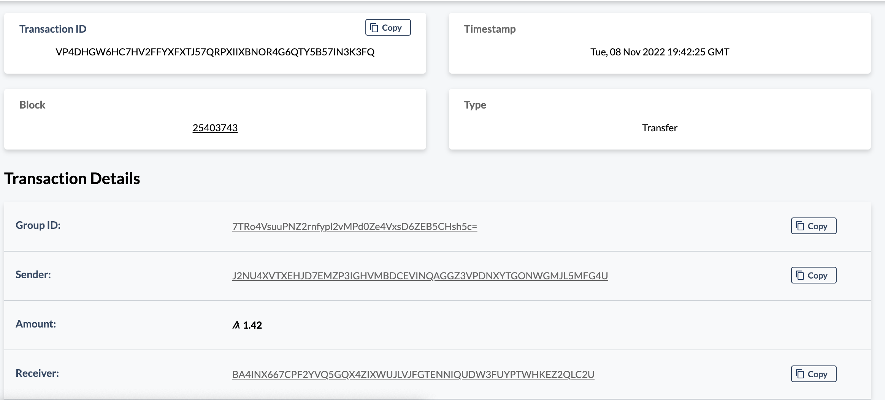

    # Form to Fill Out

    ## Step 1.1:

    * Address of account A: BA4INX667CPF2YVQ5GQX4ZIXWUJLVJFGTENNIQUDW3FUYPTWHKEZ2QLC2U
    
    * Address of account B: J2NU4XVTXEHJD7EMZP3IGHVMBDCEVINQAGGZ3VPDNXYTGONWGMJL5MFG4U
    

    ## Step 2:

    * Transaction ID from account A: KP54LLK3HVNGZ6WRSQBRXAP4GLZORULKR5NXNOIRLZRCGVD2FKWQ
    

    * Transaction ID from account B: VP4DHGW6HC7HV2FFYXFXTJ57QRPXIIXBNOR4G6QTY5B57IN3K3FQ
    

    ## Step 3.1:

    * Asset ID: 121352047
    * Name of the asset: Albi-Asset
    

    ## Step 3.2:

    * Transaction ID for opt-in of account B: PRAX3I5F4WL5CTZDOJMRVZKNZXH57XYVWUA6IBPWJUDBWF2O6WTQ
    

    ## Step 3.3:

    * Transaction ID for transfer of asset from A to B: 553IB7TVUALKMUWENP4Y6EYSDLJH7NHIY3UU7JNPXHRL634S6KVQ
    

    ## Step 4:

    * Transaction ID of the first transaction of the atomic transfer: 3DHOSOVNKK3KV632FWWTGS5UQYMPSQBM45XE2BH73AOIHXL6SZJQ
    

    ## Step 5.1:

    * Transaction ID for opt-in of account A: 6S64YWNWM2EETLQJR6TUVFN6L26R74HTYGKQKOGHS43P7TOY6TUA
    

    ## Step 5.2:

    * Transaction ID of the first transaction of the atomic transfer: BVDUIAFFP27DTR7OI7IRTBFBTL3LCI24GPEU3447BHHFLW7OBS2Q
    
